# 要件定義 - フラワーショップ「フレール・メモワール」 WEB ショップシステム

本書は、フラワーショップ「フレール・メモワール」の WEB ショップシステムを RDRA 2.0 に基づいて整理した要件定義書です。ビジネスアーキテクチャとインセプションデッキを入力として、システム価値、外部環境、システム境界、内部構造を一貫して定義します。

## システム価値

### システムコンテキスト

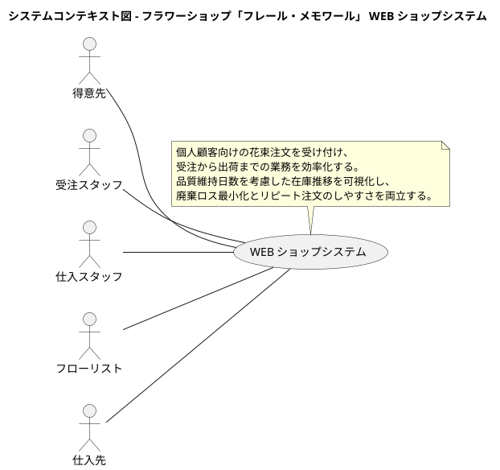

### 要求モデル

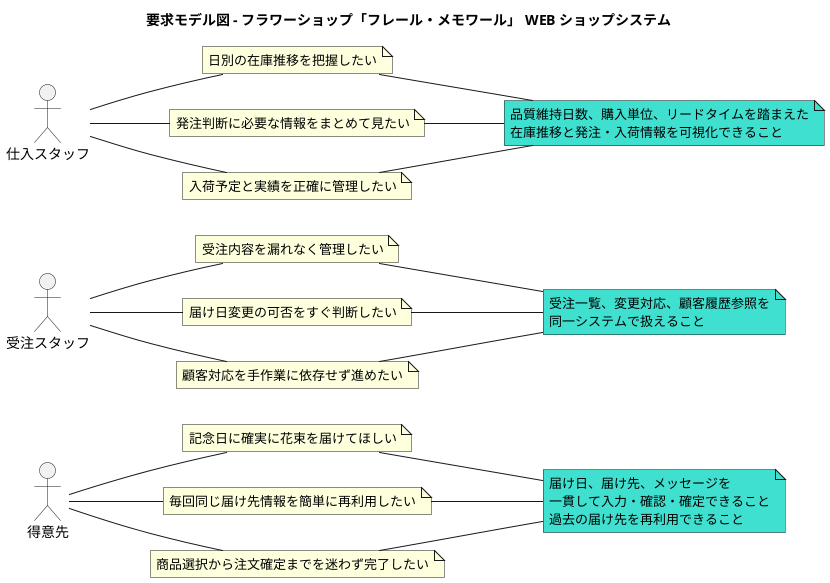

### 要求一覧

| ステークホルダー | 要求 | 派生要件 |
| :--- | :--- | :--- |
| 得意先 | 記念日に確実に花束を届けてほしい | 注文時に届け日を指定でき、出荷管理まで追跡できること |
| 得意先 | リピート注文を簡単にしたい | 過去の届け先をコピーして再利用できること |
| 得意先 | 注文を迷わず完了したい | 商品選択、届け先入力、メッセージ入力、確認を画面遷移として整理すること |
| 受注スタッフ | 受注内容を一元管理したい | 受注一覧、受注詳細、変更履歴を管理できること |
| 受注スタッフ | 届け日変更の可否を即時判断したい | 在庫推移と出荷条件を参照して変更可否を判断できること |
| 仕入スタッフ | 廃棄ロスを減らしたい | 在庫推移と品質維持期限を可視化できること |
| 仕入スタッフ | 発注判断を支援してほしい | 発注対象、必要数量、仕入先、リードタイムを把握できること |
| フローリスト | 出荷日に必要な花材を確実に揃えたい | 花束構成と出荷予定から必要花材を確認できること |

## システム外部環境

### ビジネスコンテキスト

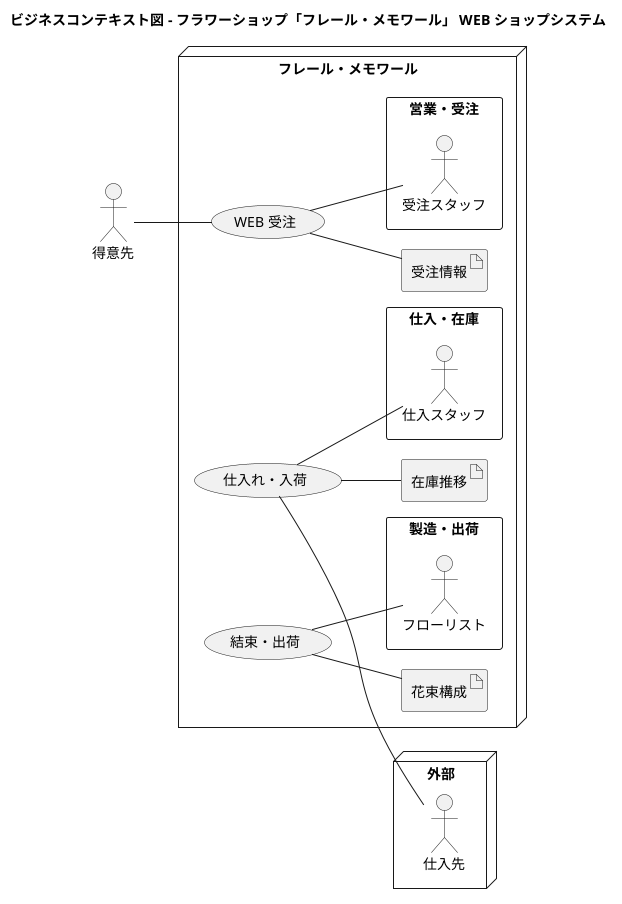

### ビジネスユースケース

#### WEB 受注

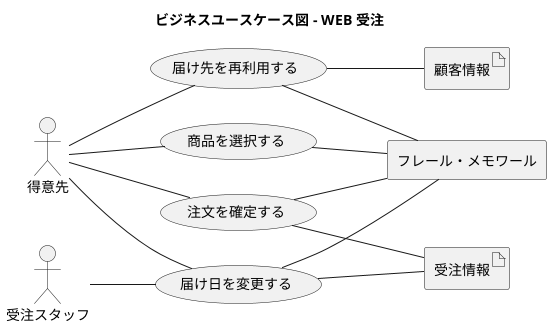

#### 仕入れ・入荷

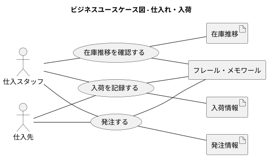

#### 結束・出荷

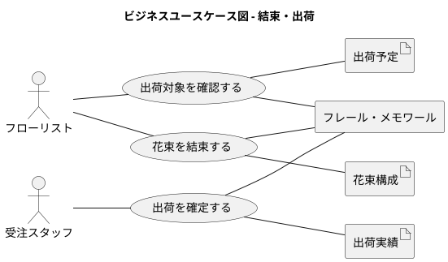

### 業務フロー

#### 商品を選択して注文を確定する業務フロー

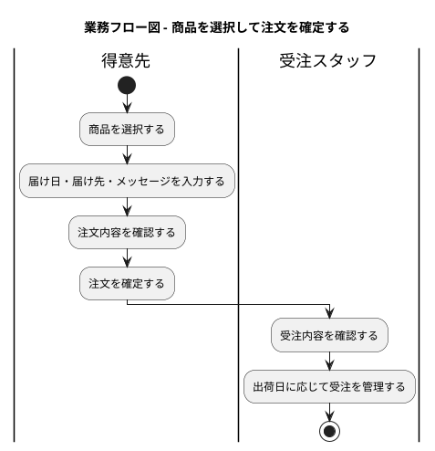

#### 届け日を変更する業務フロー

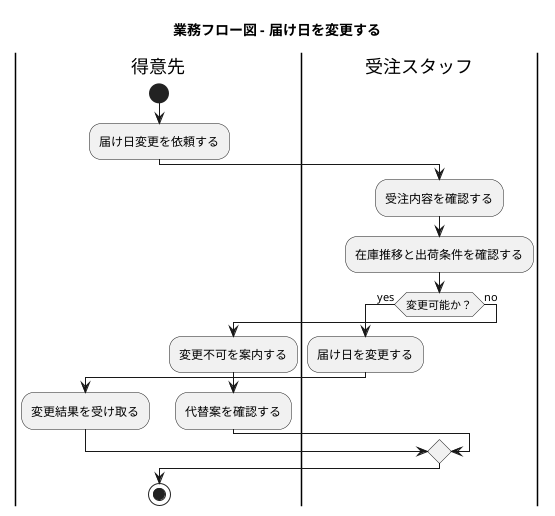

#### 在庫推移を確認して発注する業務フロー

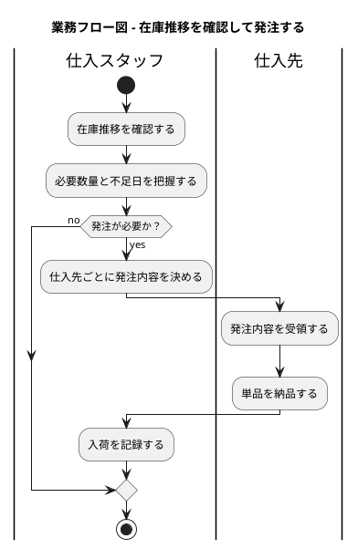

### 利用シーン

#### 記念日向けの新規注文

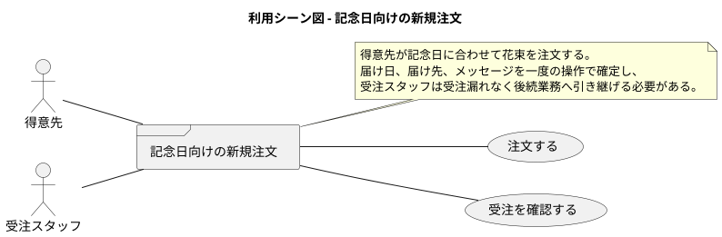

#### リピーターによる再注文

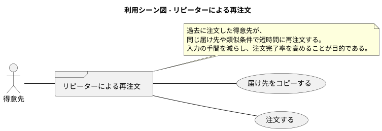

#### 在庫確認にもとづく発注判断

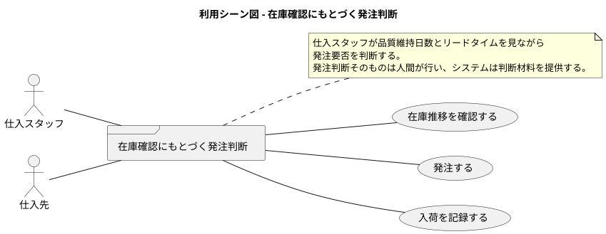

### バリエーション・条件

#### 顧客種別

| 分類 | 説明 |
|----------|------|
| 新規顧客 | 過去の届け先履歴を持たない顧客 |
| リピーター | 過去の注文履歴や届け先履歴を再利用できる顧客 |

#### 受注変更可否

| 分類 | 説明 |
|----------|------|
| 変更可能 | 在庫と出荷準備状況の条件を満たし、届け日変更を受け付けられる |
| 変更不可 | 在庫不足または出荷準備済みで、届け日変更を受け付けられない |

#### 在庫状態

| 分類 | 説明 |
|----------|------|
| 余裕あり | 予定出荷に対して十分な在庫がある |
| 要発注 | 将来不足が予測され、発注判断が必要である |
| 廃棄注意 | 品質維持期限が近く、廃棄リスクが高い |

## システム境界

### ユースケース複合図

#### 受注管理

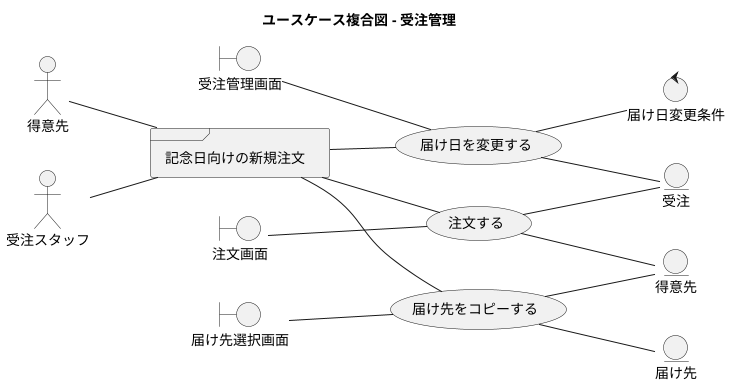

#### 仕入管理

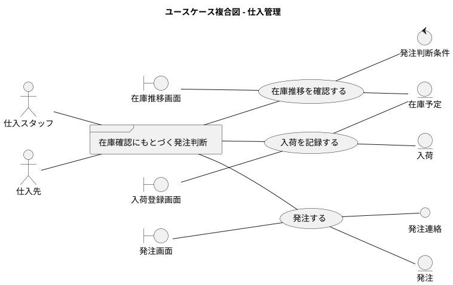

#### 出荷管理

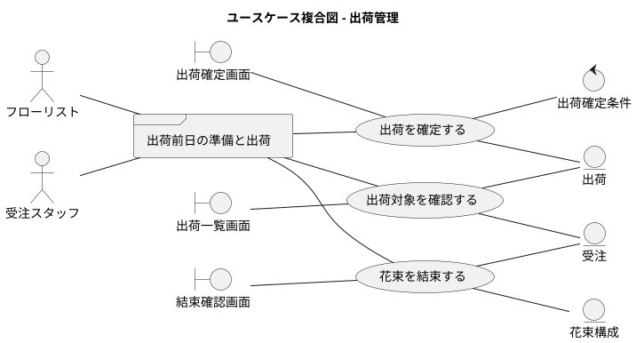

### 画面・帳票モデル

| 種別 | 名称 | 主な利用者 | 目的 |
| :--- | :--- | :--- | :--- |
| 画面 | 注文画面 | 得意先 | 商品選択、届け日、届け先、メッセージ入力 |
| 画面 | 注文確認画面 | 得意先 | 注文内容の確認と確定 |
| 画面 | 届け先選択画面 | 得意先 | 過去の届け先の再利用 |
| 画面 | 受注管理画面 | 受注スタッフ | 受注一覧参照、変更対応、顧客対応 |
| 画面 | 在庫推移画面 | 仕入スタッフ | 日別在庫予定数、廃棄注意、発注判断材料の確認 |
| 画面 | 発注画面 | 仕入スタッフ | 発注内容の作成と送信 |
| 画面 | 入荷登録画面 | 仕入スタッフ | 入荷予定と実績の登録 |
| 画面 | 出荷一覧画面 | フローリスト、受注スタッフ | 出荷対象、出荷日、必要花材の確認 |
| 帳票 | 発注一覧 | 仕入スタッフ | 仕入先別の発注内容の確認 |
| 帳票 | 出荷一覧 | フローリスト | 当日作業対象の確認 |

### イベントモデル

| イベント | 発生元 | 受信先 | 内容 |
| :--- | :--- | :--- | :--- |
| 注文確定 | 得意先 | 受注管理 | 新規受注を登録する |
| 届け日変更依頼 | 得意先 | 受注管理 | 既存受注の届け日変更を依頼する |
| 発注実行 | 仕入スタッフ | 仕入先 | 発注内容を通知する |
| 入荷完了 | 仕入先 | 仕入管理 | 納品された単品の受領を登録する |
| 出荷確定 | 受注スタッフ | 出荷管理 | 出荷実績を確定する |

## システム

### 情報モデル

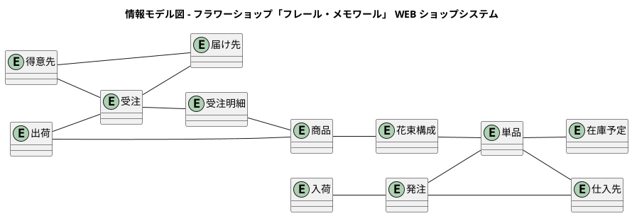

### 状態モデル

#### 受注の状態遷移

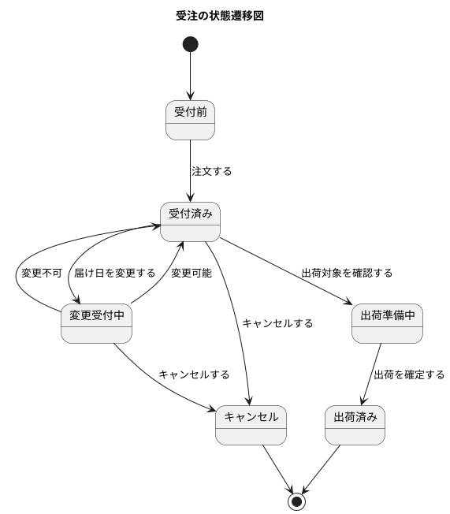

#### 発注の状態遷移

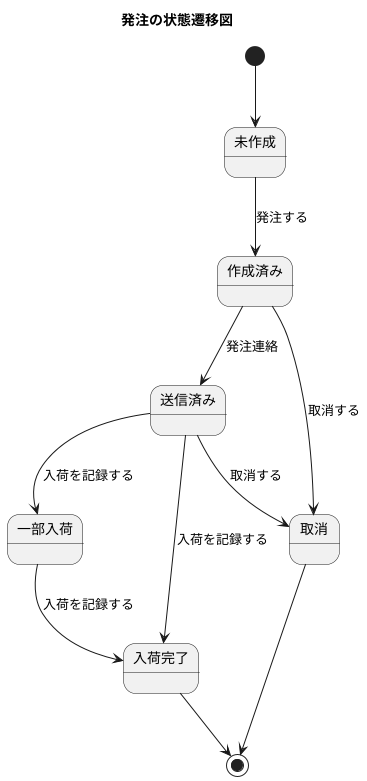

#### 出荷の状態遷移

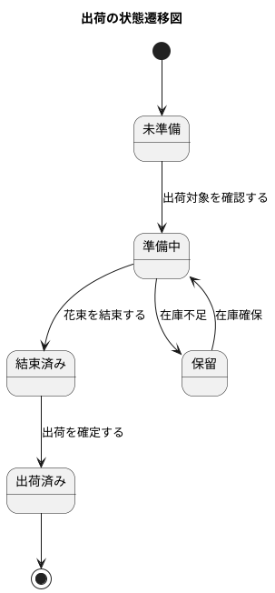

### ビジネスルール

| ID | ルール |
| :--- | :--- |
| BR-01 | 1 受注は 1 届け先、1 商品を前提とする |
| BR-02 | 出荷日は届け日の前日とする |
| BR-03 | 発注判断はスタッフが行い、システムは判断材料を提供する |
| BR-04 | 在庫推移は品質維持日数、購入単位、リードタイムを考慮して算出する |
| BR-05 | 得意先は過去の届け先情報を再利用できる |
| BR-06 | 届け日変更は在庫と出荷準備状況の条件を満たす場合のみ受け付ける |

### 今後の詳細化ポイント

- システムユースケースごとの主成功シナリオと代替フローは、後続の `analyzing-usecases` で完全形式に落とし込みます。
- 画面遷移、画面要素、操作手順の具体化は、後続の `analyzing-ui-design` で定義します。
- 情報モデルの属性、主キー、関連多重度は、後続の `analyzing-data-model` で詳細化します。
- 状態遷移の条件式と例外系は、ユースケース詳細化とドメインモデル設計で精緻化します。
