# 要件定義 - フレール・メモワール WEB ショップシステム

## システム価値

### システムコンテキスト

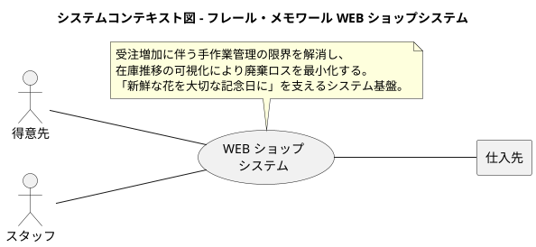

### 要求モデル

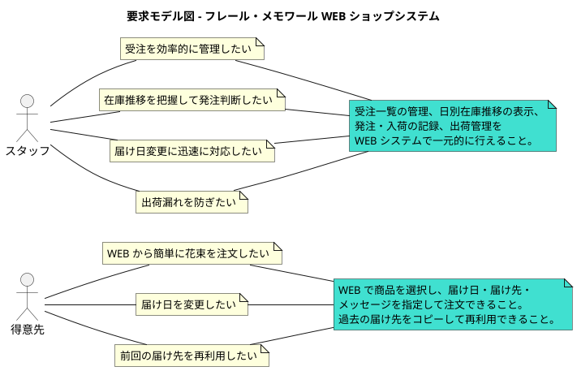

## システム外部環境

### ビジネスコンテキスト

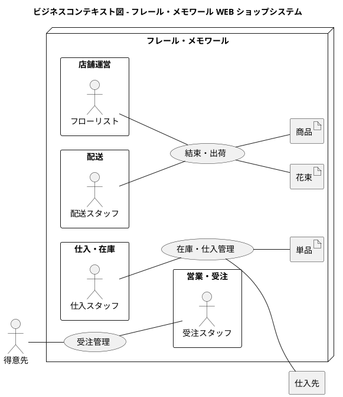

### ビジネスユースケース

#### 受注管理

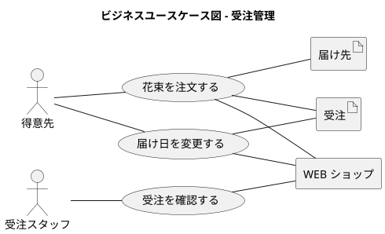

#### 在庫・仕入管理

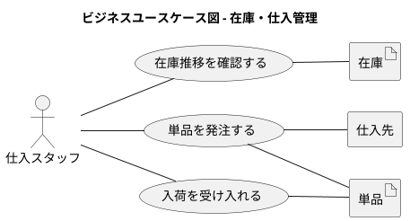

#### 結束・出荷

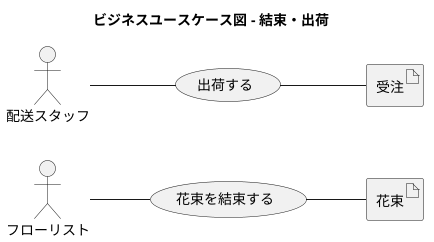

### 業務フロー

#### 花束を注文する（BUC01）

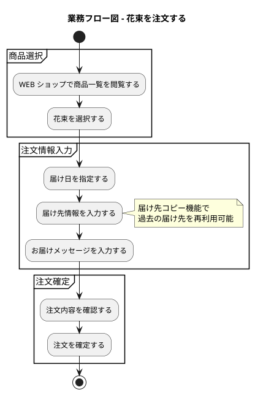

#### 届け日を変更する（BUC02）

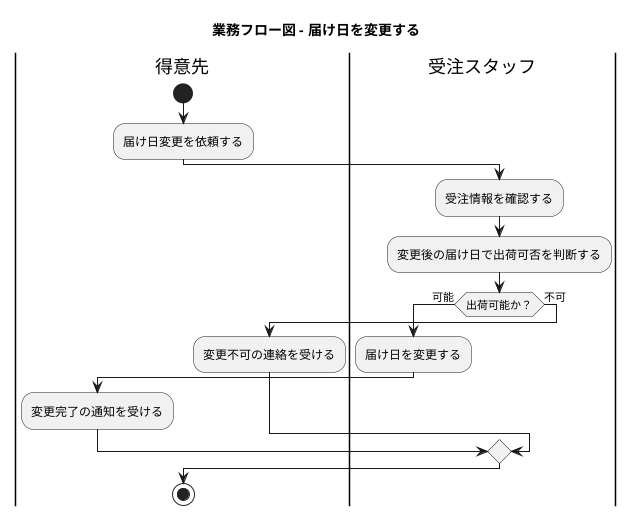

#### 在庫推移を確認し発注する（BUC04・05）

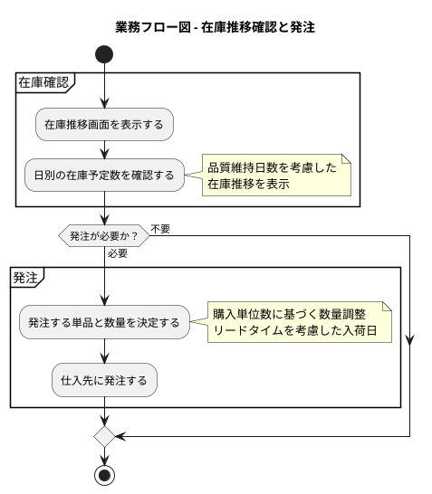

#### 入荷を受け入れる（BUC06）

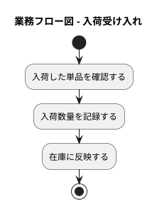

#### 結束・出荷する（BUC07・08）

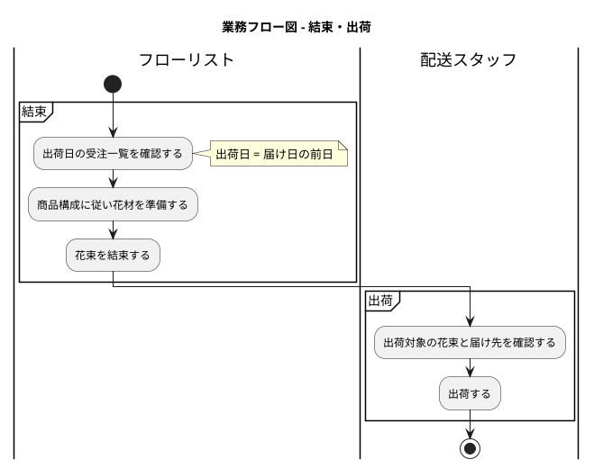

### 利用シーン

#### 受注管理の利用シーン

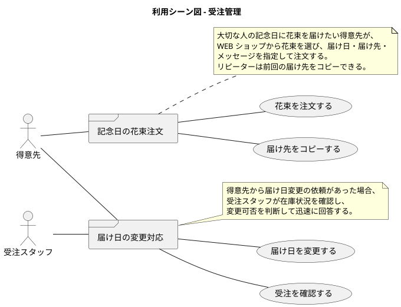

#### 在庫・仕入管理の利用シーン

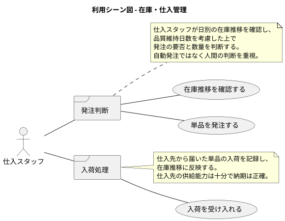

### バリエーション・条件

#### 受注状態

| 状態 | 説明 |
| :--- | :--- |
| 注文済み | 得意先が注文を確定した状態 |
| 出荷準備中 | 結束作業が完了し出荷待ちの状態 |
| 出荷済み | 配送に出した状態 |
| キャンセル | 注文がキャンセルされた状態 |

#### 在庫種別

| 種別 | 説明 |
| :--- | :--- |
| 有効在庫 | 品質維持日数内の使用可能な在庫 |
| 引当済み在庫 | 受注に紐づけられた在庫 |
| 廃棄対象在庫 | 品質維持日数を超過した在庫 |

#### 届け日変更可否条件

| 条件 | 判定 |
| :--- | :--- |
| 変更後の届け日に必要な花材の在庫がある | 変更可能 |
| 変更後の届け日に必要な花材の在庫がない | 変更不可（得意先に通知） |

## システム境界

### ユースケース複合図

#### 受注管理

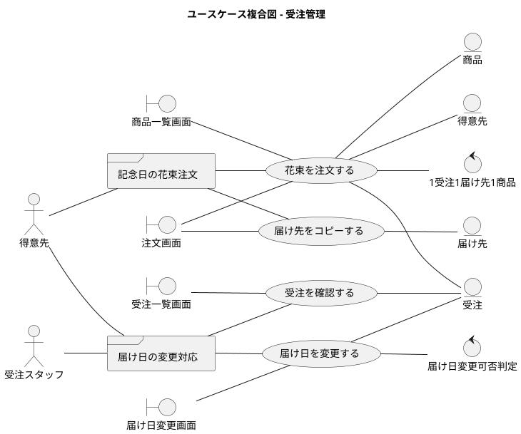

#### 在庫・仕入管理

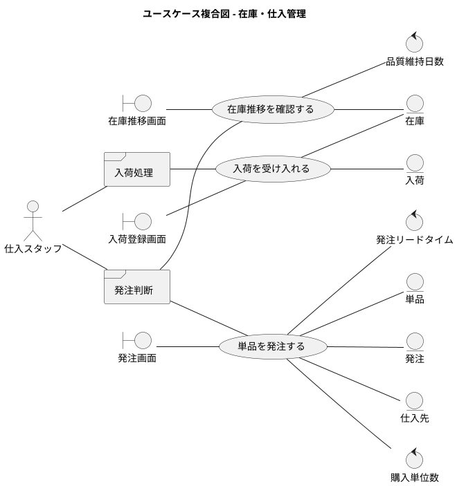

#### 結束・出荷管理

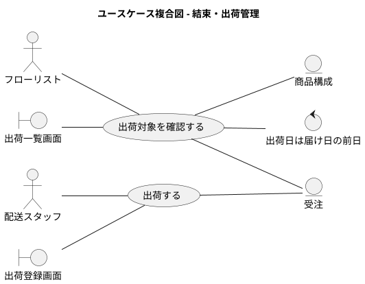

#### 商品管理

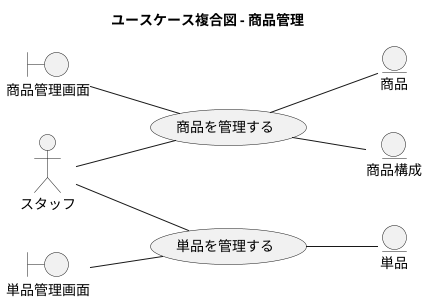

## システム

### 情報モデル

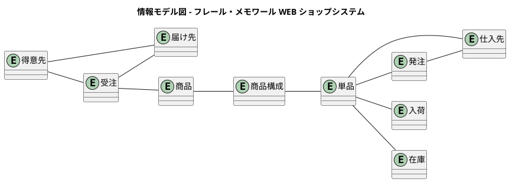

### 状態モデル

#### 受注の状態遷移

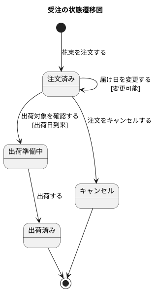

#### 在庫の状態遷移

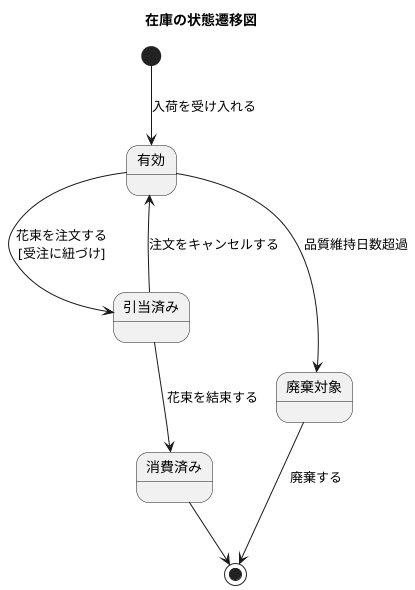

#### 発注の状態遷移

```plantuml
@startuml
title 発注の状態遷移図

[*] --> 発注済み : 単品を発注する

発注済み --> 入荷済み : 入荷を受け入れる

入荷済み --> [*]

@enduml
```
