# 要件定義 - フレール・メモワール WEB ショップシステム

## システム価値

### システムコンテキスト

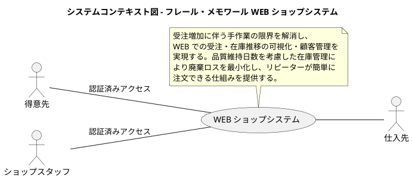

### 要求モデル

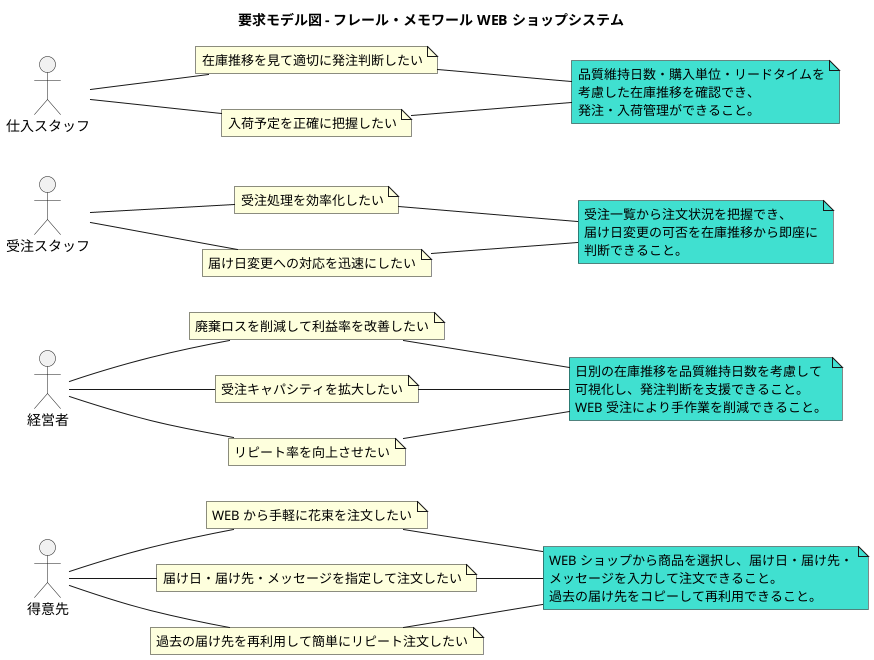

## システム外部環境

### ビジネスコンテキスト

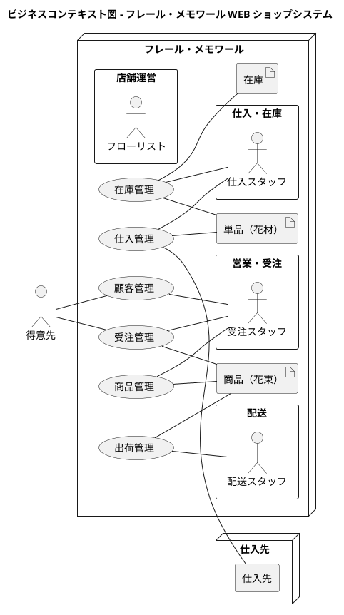

### ビジネスユースケース

#### 受注管理業務

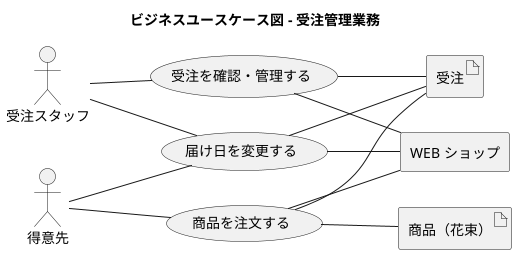

#### 在庫・仕入管理業務

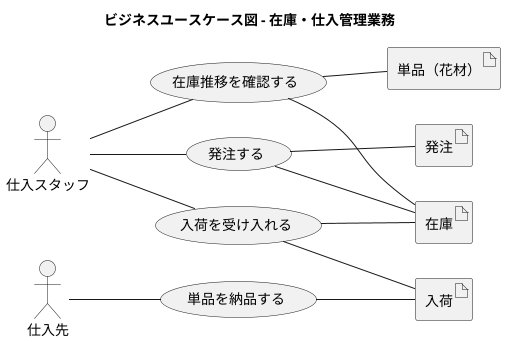

#### 出荷・配送管理業務

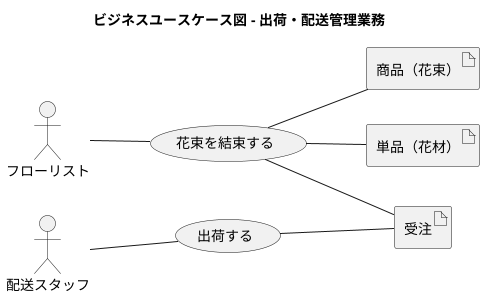

#### 顧客管理業務

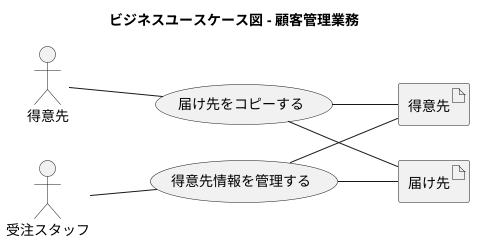

### 業務フロー

#### 商品を注文する：BUC の業務フロー

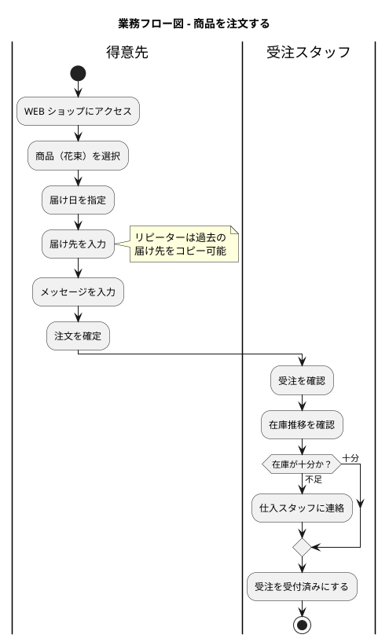

#### 在庫推移を確認し発注する：BUC の業務フロー

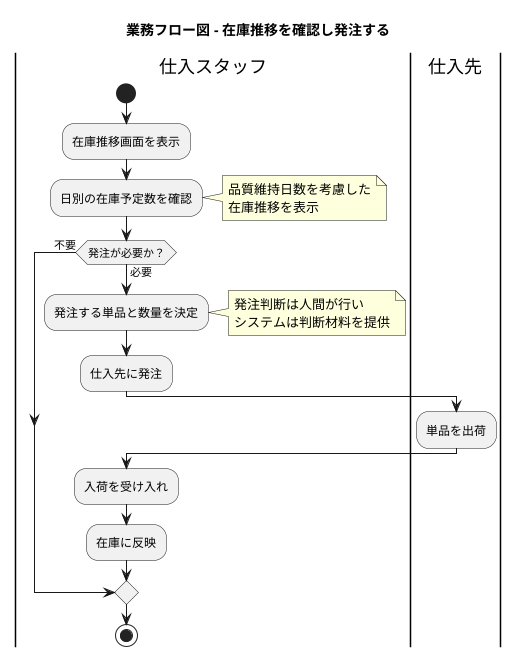

#### 出荷する：BUC の業務フロー

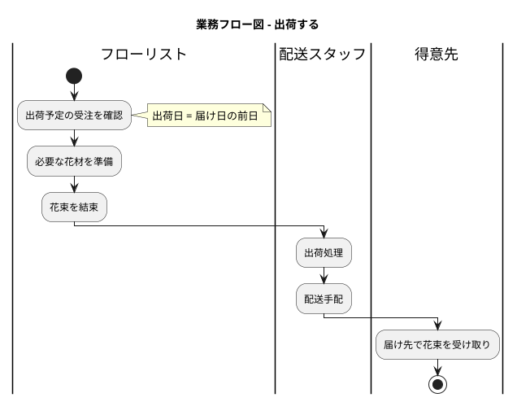

#### 届け日を変更する：BUC の業務フロー

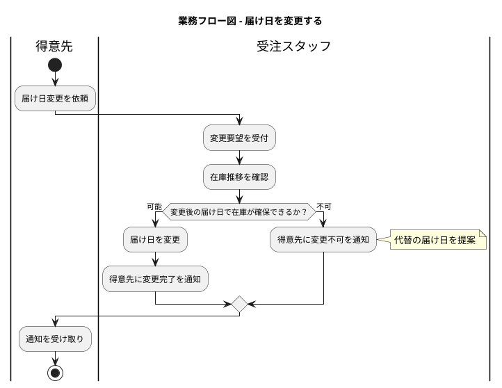

### 利用シーン

#### 受注管理の利用シーン

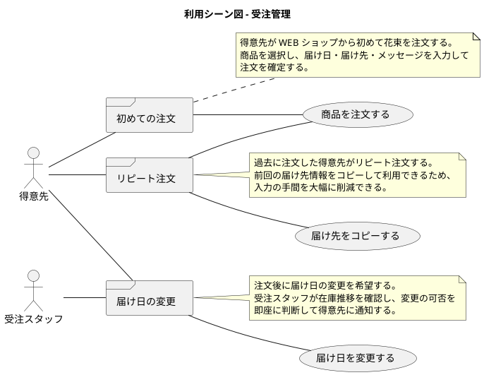

#### 在庫・仕入管理の利用シーン

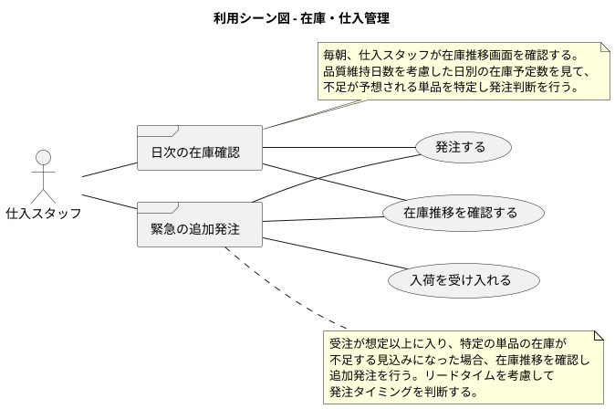

### バリエーション・条件

#### 商品種別

| 商品種別 | 説明 |
|----------|------|
| 花束 | 事前定義された花の組合せ。単品を束ねて商品化する |

#### 受注ステータス

| ステータス | 説明 |
|----------|------|
| 注文受付 | 得意先が注文を確定した状態 |
| 受付済み | 受注スタッフが受注を確認・受け付けた状態 |
| 出荷準備中 | 花束の結束が完了し、出荷を待っている状態 |
| 出荷済み | 配送手配が完了した状態 |
| 届け完了 | 届け先に届けられた状態 |
| キャンセル | 注文がキャンセルされた状態 |

#### 単品カテゴリ

| カテゴリ | 説明 |
|----------|------|
| メイン花材 | 花束の主役となる花 |
| サブ花材 | 花束を引き立てる副花材 |
| グリーン | 葉もの・枝もの |
| 資材 | ラッピング材・リボン等 |

#### 在庫状態

| 状態 | 説明 |
|----------|------|
| 入荷予定 | 発注済みで入荷を待っている状態 |
| 在庫あり | 入荷済みで品質維持期限内の状態 |
| 品質低下 | 品質維持日数に近づいている状態 |
| 廃棄対象 | 品質維持日数を超過した状態 |

## システム境界

### ユースケース複合図

#### 受注管理

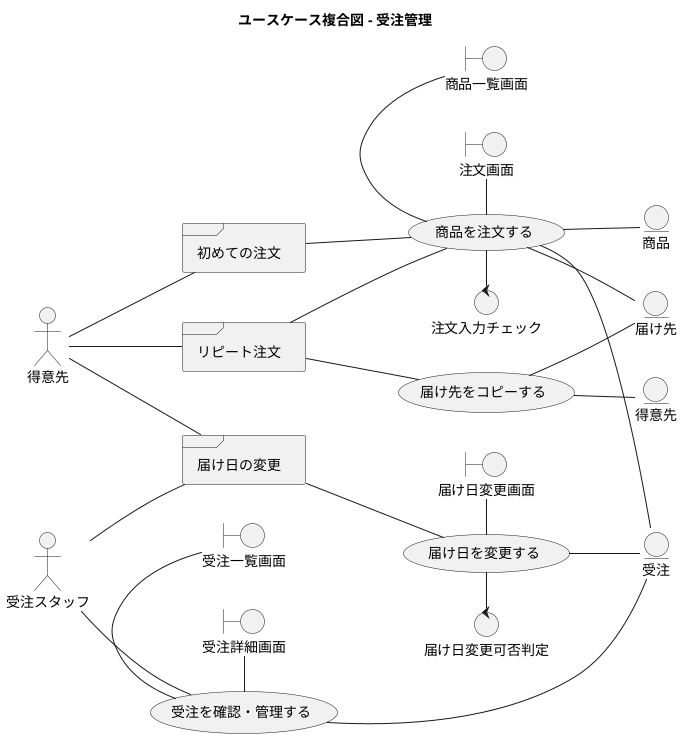

#### 在庫・仕入管理

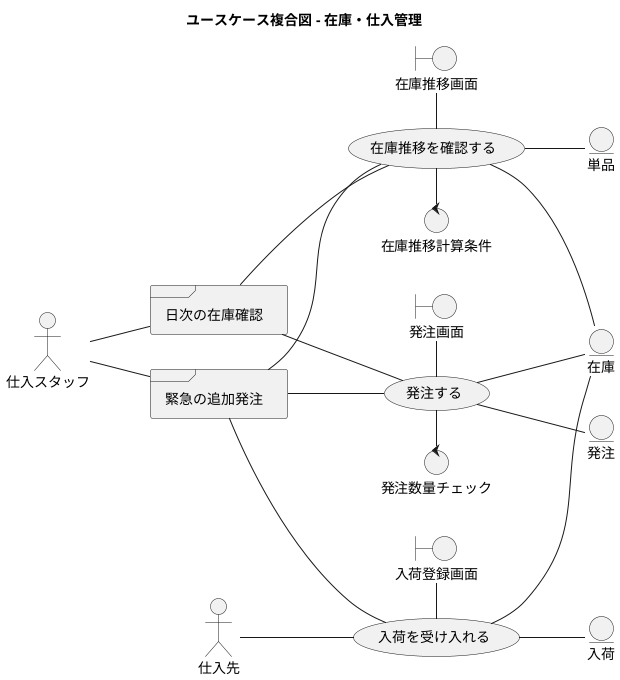

#### 出荷管理

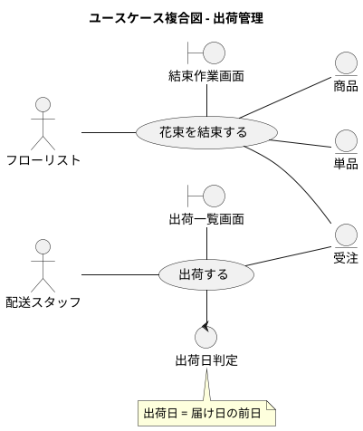

#### 商品管理

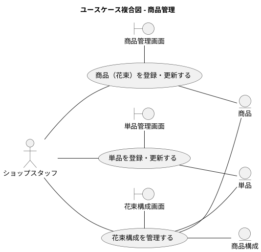

## システム

### 情報モデル

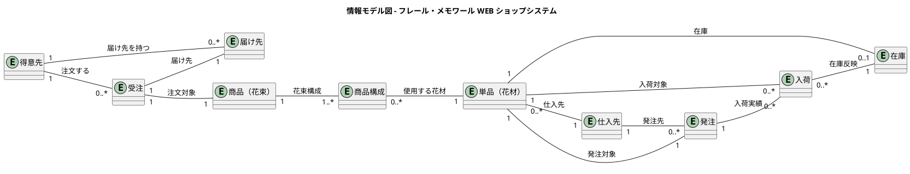

### 状態モデル

### ビジネスルール

#### 在庫推移計算ルール

在庫推移は以下の要素から日別に算出する。

```
日別在庫予定数 = 前日在庫 + 当日入荷予定 - 当日受注引当 - 当日廃棄予定
```

| 要素 | 計算方法 |
|------|----------|
| 前日在庫 | 前日時点の有効在庫数（品質維持期限内） |
| 当日入荷予定 | 発注済み・一部入荷の発注から、希望納品日が当日のもの |
| 当日受注引当 | 届け日の前日（出荷日）に必要な花材数。商品構成 × 受注数で算出 |
| 当日廃棄予定 | 入荷日 + 品質維持日数 = 当日 となる在庫 |

**1 注文 = 1 商品ルール**: 1 件の受注には 1 種類の商品（花束）のみ。複数商品の注文は複数の受注として登録する。

#### 境界値

| 項目 | 制約 |
|------|------|
| 届け日 | 翌日〜30 日後まで指定可能 |
| お届けメッセージ | 最大 200 文字 |
| 商品価格 | 1 円〜999,999 円 |
| 発注数量 | 購入単位の倍数。上限 9,999 |
| 品質維持日数 | 1〜30 日 |
| リードタイム | 1〜14 日 |
| 商品名 | 最大 50 文字 |
| 単品名 | 最大 50 文字 |

### 状態モデル

#### 受注の状態遷移

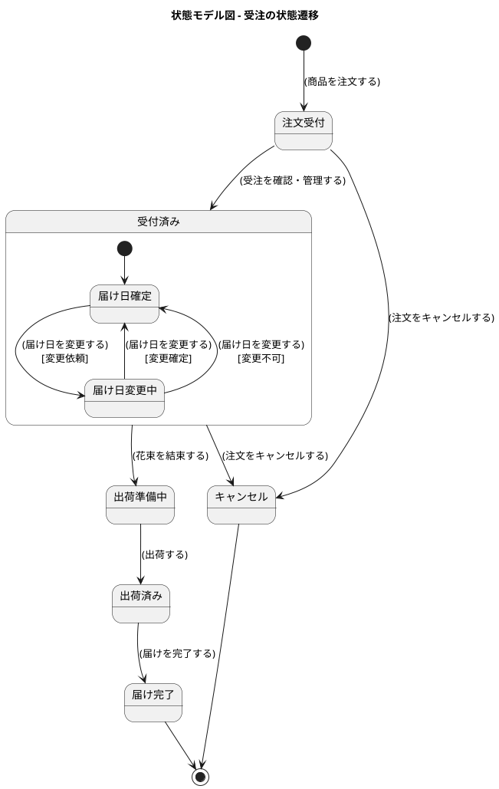

#### 受注の状態遷移表

| 現在の状態＼イベント | 注文確定 | 受付処理 | キャンセル | 結束完了 | 出荷処理 | 届け完了 | 届け日変更 |
|:---|:---:|:---:|:---:|:---:|:---:|:---:|:---:|
| （初期状態） | 注文受付 | - | - | - | - | - | - |
| 注文受付 | - | 受付済み | キャンセル | - | - | - | - |
| 受付済み | - | - | キャンセル | 出荷準備中 | - | - | 受付済み |
| 出荷準備中 | - | - | - | - | 出荷済み | - | - |
| 出荷済み | - | - | - | - | - | 届け完了 | - |
| 届け完了 | - | - | - | - | - | - | - |
| キャンセル | - | - | - | - | - | - | - |

- 「-」は遷移不可を示す
- 「出荷準備中」以降はキャンセル・届け日変更不可

#### 在庫の状態遷移

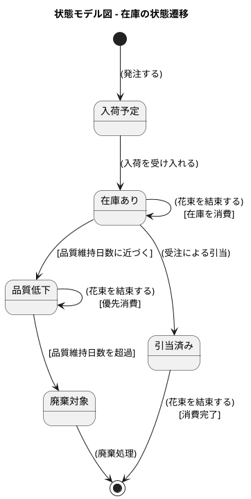

#### 発注の状態遷移

```plantuml
@startuml

title 状態モデル図 - 発注の状態遷移

[*] --> 発注済み : (発注する)
発注済み --> 入荷済み : (入荷を受け入れる)
発注済み --> 一部入荷 : (入荷を受け入れる)\n[一部のみ入荷]
一部入荷 --> 入荷済み : (入荷を受け入れる)\n[残数入荷]

入荷済み --> [*]

@enduml
```

---

## 記入履歴

| 日付 | 更新内容 |
|------|----------|
| 2026-03-20 | 初版作成。RDRA 2.0 の 4 層構造に基づき要件定義を作成 |
| 2026-03-20 | レビュー指摘反映。情報モデルにカーディナリティ追加、在庫推移計算ルール・境界値・状態遷移表追加、認証コンテキスト追加 |
