# 要件定義 - フレール・メモワール WEB ショップシステム

## システム価値

### システムコンテキスト

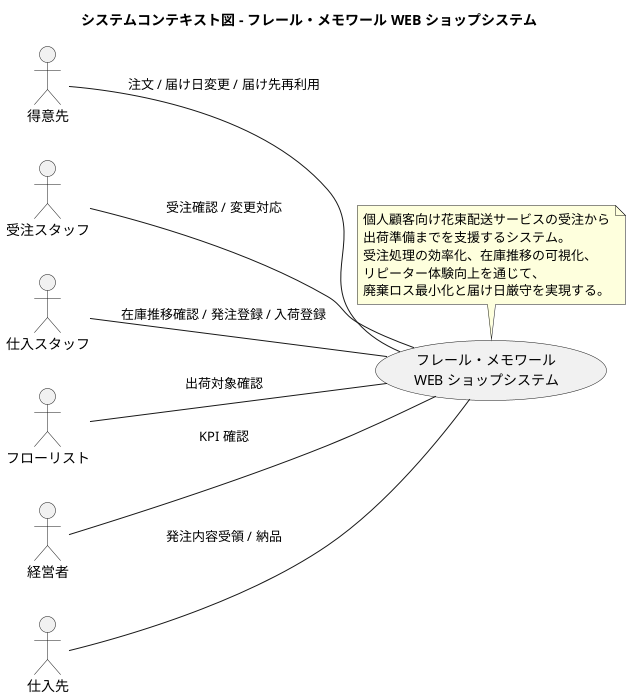

### 要求モデル

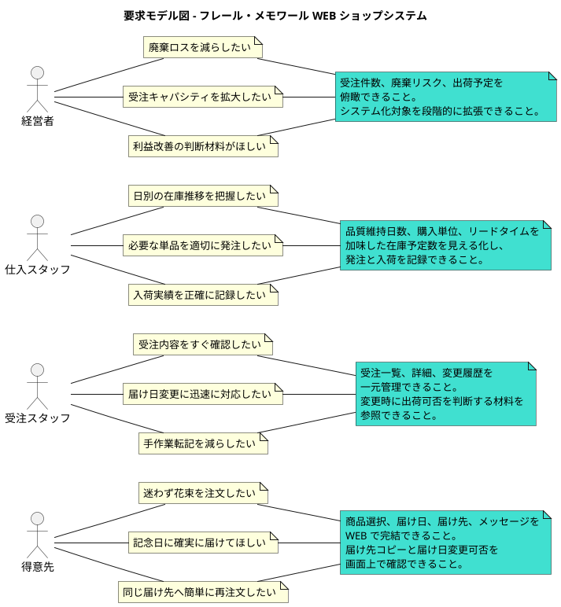

### 要求一覧

| アクター | 要求 | 根拠 |
| :--- | :--- | :--- |
| 得意先 | 花束を WEB で簡単に注文したい | 電話や手作業受付の限界を解消するため |
| 得意先 | 記念日に確実に届けてほしい | ビジネス価値「届け日厳守」の実現 |
| 得意先 | 届け先を再利用して素早く再注文したい | リピーター重視の方針に対応するため |
| 受注スタッフ | 受注内容と変更履歴を一元管理したい | 手作業転記と確認漏れを減らすため |
| 仕入スタッフ | 在庫推移を見ながら発注判断したい | 廃棄ロスと欠品の両方を減らすため |
| 経営者 | 廃棄リスクと受注量を把握したい | 利益改善と段階的投資判断のため |

## システム外部環境

### ビジネスコンテキスト

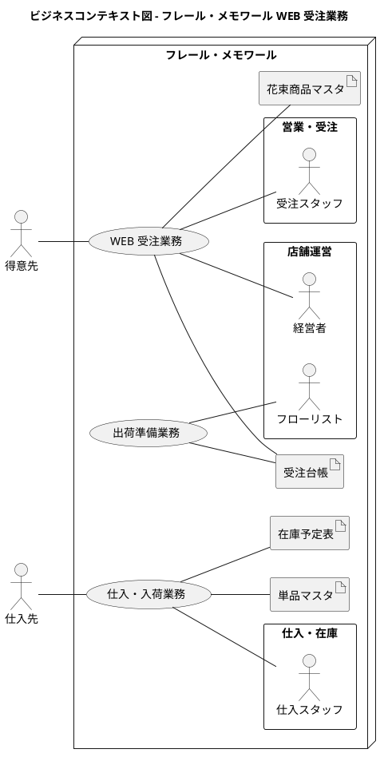

### ビジネスユースケース

#### WEB 受注業務

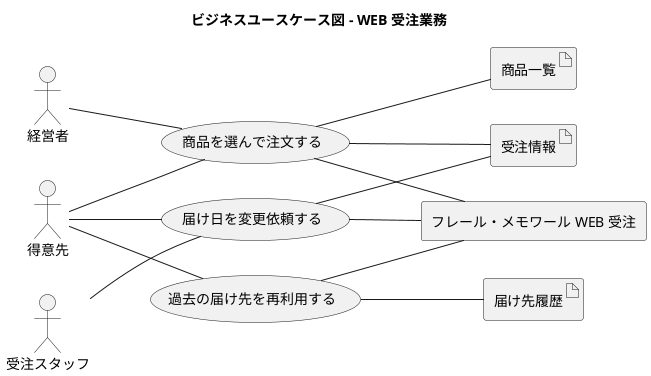

#### 仕入・入荷業務

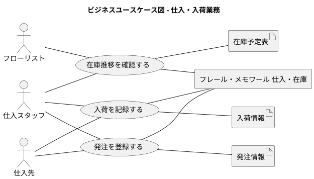

### 業務フロー

#### 商品を選んで注文する業務フロー

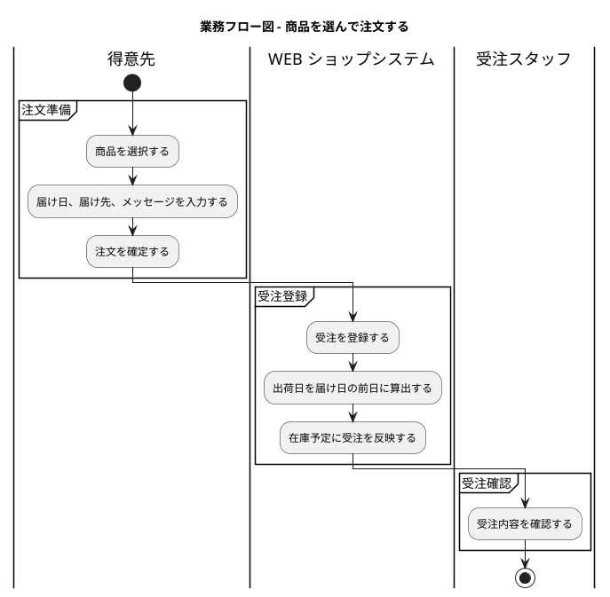

#### 届け日を変更依頼する業務フロー

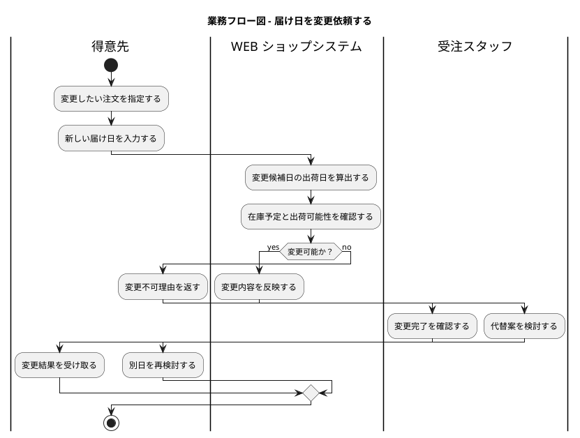

#### 発注を登録して入荷を記録する業務フロー

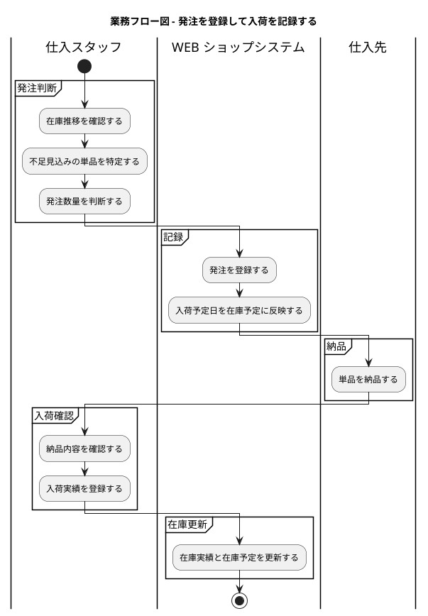

### 利用シーン

#### 記念日向けの新規注文

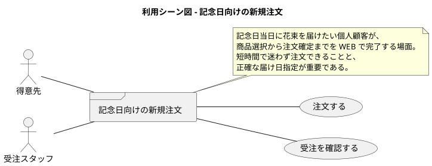

#### リピーターによる再注文と届け日変更

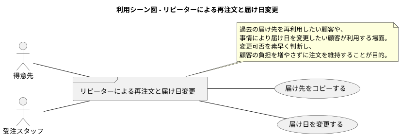

### バリエーション・条件

#### 注文種別

| 種別 | 説明 |
| :--- | :--- |
| 新規注文 | 初めて入力する届け先で行う注文 |
| 再注文 | 過去の届け先をコピーして行う注文 |
| 変更注文 | 既存受注の届け日を変更する注文 |

#### 在庫判定

| 判定 | 説明 |
| :--- | :--- |
| 充足 | 出荷日までに必要数量を確保できる状態 |
| 不足見込み | 発注または代替判断が必要な状態 |
| 廃棄リスク | 品質維持期限超過により利用できない在庫が含まれる状態 |

#### 業務ルール

| ルール | 内容 |
| :--- | :--- |
| 1 受注 1 商品 | 1 回の注文は 1 商品を対象とする |
| 1 受注 1 届け先 | 1 回の注文で指定できる届け先は 1 件のみ |
| 出荷日 | 出荷日は届け日の前日とする |
| 発注判断 | 発注数量の最終判断はスタッフが行う |
| 対象顧客 | 個人顧客のみを対象とする |

## システム境界

### ユースケース複合図

#### 顧客注文と変更対応

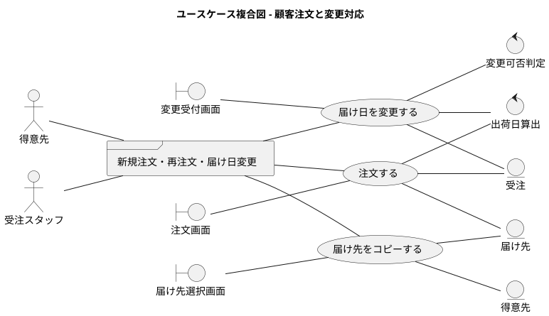

#### 在庫確認と仕入・出荷準備

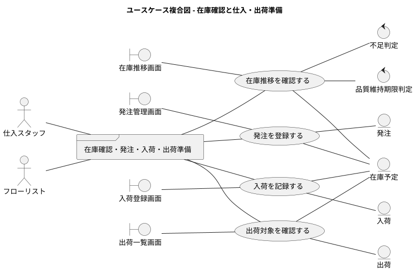

### 画面・帳票モデル

| 種別 | 名称 | 主利用者 | 目的 |
| :--- | :--- | :--- | :--- |
| 画面 | 注文画面 | 得意先 | 商品選択、届け日、届け先、メッセージ入力を行う |
| 画面 | 届け先選択画面 | 得意先 | 過去の届け先を検索・コピーする |
| 画面 | 変更受付画面 | 得意先、受注スタッフ | 届け日変更を受け付け、可否を表示する |
| 画面 | 受注一覧画面 | 受注スタッフ | 受注状況、変更状況を確認する |
| 画面 | 在庫推移画面 | 仕入スタッフ、経営者 | 日別の在庫予定数と廃棄リスクを確認する |
| 画面 | 発注管理画面 | 仕入スタッフ | 発注内容と入荷予定を登録する |
| 画面 | 入荷登録画面 | 仕入スタッフ | 納品された単品の入荷実績を記録する |
| 画面 | 出荷一覧画面 | フローリスト | 出荷日ごとの結束対象を確認する |
| 帳票 | 発注一覧 | 仕入スタッフ、仕入先 | 発注内容を共有する |
| 帳票 | 出荷一覧 | フローリスト | 当日準備が必要な花束を把握する |

### イベントモデル

| イベント | 発生元 | 受信側 | 内容 |
| :--- | :--- | :--- | :--- |
| 注文確定 | 得意先 | WEB ショップシステム | 受注、出荷日、在庫予定を作成する |
| 届け日変更要求 | 得意先 / 受注スタッフ | WEB ショップシステム | 在庫予定を再計算し、変更可否を判定する |
| 発注登録 | 仕入スタッフ | WEB ショップシステム | 発注情報と入荷予定を記録する |
| 入荷確定 | 仕入スタッフ | WEB ショップシステム | 入荷実績を記録し、在庫予定を更新する |
| 出荷対象抽出 | 定時処理 / スタッフ操作 | WEB ショップシステム | 出荷日に対応する花束一覧を生成する |

## システム

### 情報モデル

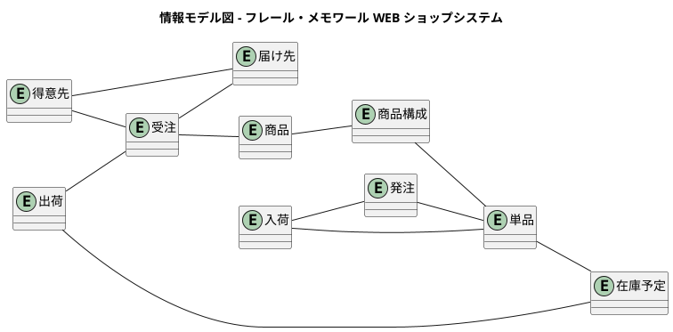

### 状態モデル

#### 受注の状態遷移

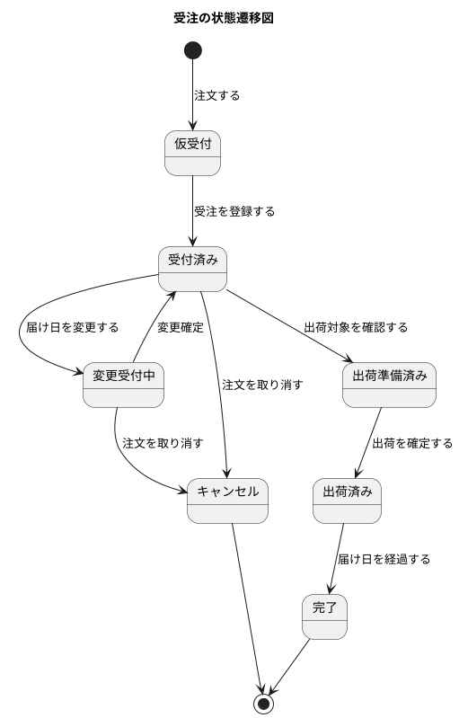

#### 発注の状態遷移

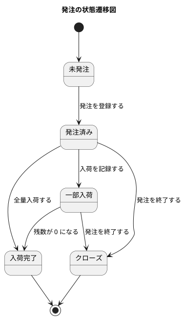

### 要件サマリー

| 分類 | 要件 |
| :--- | :--- |
| 機能要件 | 顧客が商品を選択して注文できること |
| 機能要件 | 顧客が過去の届け先を再利用できること |
| 機能要件 | 顧客またはスタッフが届け日変更可否を確認し変更できること |
| 機能要件 | スタッフが日別の在庫推移と廃棄リスクを確認できること |
| 機能要件 | スタッフが発注と入荷を登録できること |
| 機能要件 | フローリストが出荷対象を確認できること |
| 制約 | 自動発注は行わず、発注判断は人間が担うこと |
| 制約 | 対象顧客は個人顧客のみであること |
| 制約 | 決済処理は本システムの対象外であること |
| TBD | 品質維持期限アラートを通知機能として実装するかは別途検討すること |
| TBD | 配送状況トラッキングの要否は別途検討すること |
