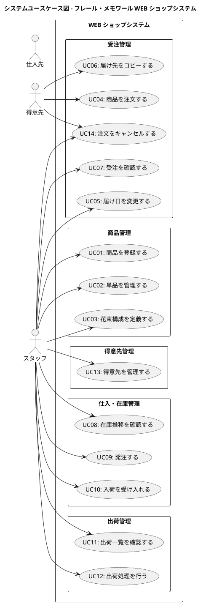

# システムユースケース

## システムユースケース図

## システムユースケース一覧

| UC-ID | ユースケース名 | スコープ | レベル | 主アクター | 元 BUC |
|-------|---------------|---------|--------|-----------|--------|
| UC-01 | 商品を登録する | システム | ユーザー目的 | スタッフ | BUC-01 |
| UC-02 | 単品を管理する | システム | ユーザー目的 | スタッフ | BUC-03 |
| UC-03 | 花束構成を定義する | システム | ユーザー目的 | スタッフ | BUC-02 |
| UC-04 | 商品を注文する | システム | ユーザー目的 | 得意先 | BUC-04 |
| UC-05 | 届け日を変更する | システム | ユーザー目的 | スタッフ | BUC-05 |
| UC-06 | 届け先をコピーする | システム | サブ機能 | 得意先 | BUC-06 |
| UC-07 | 受注を確認する | システム | ユーザー目的 | スタッフ | BUC-07 |
| UC-08 | 在庫推移を確認する | システム | ユーザー目的 | スタッフ | BUC-08 |
| UC-09 | 発注する | システム | ユーザー目的 | スタッフ | BUC-09 |
| UC-10 | 入荷を受け入れる | システム | ユーザー目的 | スタッフ | BUC-10 |
| UC-11 | 出荷一覧を確認する | システム | ユーザー目的 | スタッフ | BUC-11 |
| UC-12 | 出荷処理を行う | システム | ユーザー目的 | スタッフ | BUC-12 |
| UC-13 | 得意先を管理する | システム | ユーザー目的 | スタッフ | BUC-04 |
| UC-14 | 注文をキャンセルする | システム | ユーザー目的 | 得意先 | BUC-04 |

**凡例**: ユースケースタイトルのアイコンはレベルを示す。🖥️ = システムスコープ、🌊 = ユーザー目的レベル、🐟 = サブ機能レベル

---

## UC-01: 🖥️商品を登録する🌊

**コンテキスト**: スタッフが新しい花束商品をシステムに登録する。商品は花束構成（単品の組合せ）として定義される。

**スコープ**: WEB ショップシステム

**レベル**: ユーザー目的

**主アクター**: スタッフ

**利害関係者と利益**:

- スタッフ: 商品情報を正確に登録し、WEB ショップに掲載したい
- 得意先: 正確な商品情報で花束を選びたい
- 経営者: 魅力的な商品ラインナップで売上を伸ばしたい

**事前条件**:

- スタッフがシステムにログイン済みであること

**最低保証**: 不正なデータは保存されない

**成功時保証**: 新しい商品が登録され、WEB ショップで表示可能になる

**トリガー**: スタッフが商品管理画面から新規登録を選択する

**主成功シナリオ**:

1. スタッフが商品名・説明・価格を入力する
2. システムが入力内容を検証する
3. システムが商品を登録する
4. システムが登録完了を表示する

**拡張**:

- 2a. 入力内容が不正:
    - 2a1. システムがエラー内容を表示する
    - 2a2. スタッフが入力を修正する（ステップ 1 へ）

---

## UC-02: 🖥️単品を管理する🌊

**コンテキスト**: スタッフが単品（花）のマスタ情報を登録・更新する。品質維持日数やリードタイムは在庫推移の計算に使用される。

**スコープ**: WEB ショップシステム

**レベル**: ユーザー目的

**主アクター**: スタッフ

**利害関係者と利益**:

- スタッフ: 単品の情報を正確に管理し、在庫管理の精度を上げたい
- 仕入スタッフ: 品質維持日数とリードタイムを把握して適切に発注したい

**事前条件**:

- スタッフがシステムにログイン済みであること

**最低保証**: 不正なデータは保存されない

**成功時保証**: 単品情報が登録・更新され、在庫推移の計算に反映される

**トリガー**: スタッフが単品管理画面を開く

**主成功シナリオ**:

1. スタッフが単品名・品質維持日数・購入単位・リードタイムを入力する
2. スタッフが仕入先を選択する
3. システムが入力内容を検証する
4. システムが単品情報を保存する
5. システムが保存完了を表示する

**拡張**:

- 3a. 入力内容が不正:
    - 3a1. システムがエラー内容を表示する
    - 3a2. スタッフが入力を修正する（ステップ 1 へ）

---

## UC-03: 🖥️花束構成を定義する🌊

**コンテキスト**: スタッフが商品（花束）を構成する単品と数量を設定する。この構成は在庫の引当計算にも使用される。

**スコープ**: WEB ショップシステム

**レベル**: ユーザー目的

**主アクター**: スタッフ

**利害関係者と利益**:

- スタッフ: 花束の構成を正確に定義し、結束作業に必要な情報を提供したい
- フローリスト: 結束に必要な単品と数量を正確に把握したい

**事前条件**:

- 対象の商品が登録済みであること
- 構成に使用する単品が登録済みであること

**最低保証**: 不正な構成は保存されない

**成功時保証**: 花束の構成が定義され、在庫引当の計算に反映される

**トリガー**: スタッフが商品の構成定義画面を開く

**主成功シナリオ**:

1. スタッフが商品を選択する
2. システムが現在の構成を表示する
3. スタッフが構成する単品と数量を追加・変更する
4. システムが構成を検証する
5. システムが構成を保存する

**拡張**:

- 4a. 構成が不正（単品が未登録、数量が 0 以下）:
    - 4a1. システムがエラー内容を表示する
    - 4a2. スタッフが構成を修正する（ステップ 3 へ）

---

## UC-04: 🖥️商品を注文する🌊

**コンテキスト**: 得意先が WEB ショップから花束を選択し、届け日・届け先・メッセージを指定して注文する。1 受注 = 1 届け先 = 1 商品。

**スコープ**: WEB ショップシステム

**レベル**: ユーザー目的

**主アクター**: 得意先

**利害関係者と利益**:

- 得意先: 記念日に花束を確実に届けたい
- 経営者: 受注を増やし売上を伸ばしたい
- 受注スタッフ: 正確な注文情報を受け取りたい

**事前条件**:

- 商品が 1 つ以上登録されていること

**最低保証**: 不正な注文は受け付けない

**成功時保証**: 受注が登録され、在庫に引き当てられる

**トリガー**: 得意先が WEB ショップで商品を選択する

**主成功シナリオ**:

1. 得意先が商品カタログから花束を選択する
2. 得意先が届け日を指定する
3. 得意先が届け先（氏名・住所・電話番号）を入力する
4. 得意先がお届けメッセージを入力する
5. システムが注文内容を検証する
6. 得意先が注文を確定する
7. システムが受注を登録する
8. システムが注文確認を表示する

**拡張**:

- 3a. 過去の届け先をコピーする場合:
    - 3a1. UC-06「届け先をコピーする」を実行する
- 5a. 届け日が過去日:
    - 5a1. システムがエラーを表示する
    - 5a2. 得意先が届け日を修正する（ステップ 2 へ）

**技術およびデータのバリエーション**:

- ステップ 2: 届け日は注文日の翌日以降を指定可能

---

## UC-05: 🖥️届け日を変更する🌊

**コンテキスト**: 得意先が注文済みの花束の届け日を変更したい場合に、変更可否を確認して変更を行う。

**スコープ**: WEB ショップシステム

**レベル**: ユーザー目的

**主アクター**: スタッフ（得意先からの依頼を受けてスタッフが操作する）

**利害関係者と利益**:

- 得意先: 都合に合わせて届け日を変更したい
- 受注スタッフ: 変更に伴う在庫影響を把握したい
- フローリスト: 変更後の出荷スケジュールを把握したい

**事前条件**:

- 対象の受注が「受注済み」状態であること

**最低保証**: 出荷不可能な日への変更は行われない

**成功時保証**: 届け日が変更され、在庫引当が再計算される

**トリガー**: 得意先が届け日変更を依頼する

**主成功シナリオ**:

1. スタッフが対象の受注を表示する
2. スタッフが変更後の届け日を入力する
3. システムが変更後の届け日で在庫が確保できるか確認する
4. システムが変更可能であることを表示する
5. スタッフが変更を確定する
6. システムが届け日を変更し、在庫引当を再計算する

**拡張**:

- 3a. 変更後の届け日で在庫が確保できない:
    - 3a1. システムが変更不可と理由を表示する
    - 3a2. スタッフが得意先に通知する
    - 3a3. 終了

---

## UC-06: 🖥️届け先をコピーする🐟

**コンテキスト**: リピーターの得意先が過去の注文の届け先情報を新しい注文にコピーして利用する。

**スコープ**: WEB ショップシステム

**レベル**: サブ機能

**主アクター**: 得意先

**利害関係者と利益**:

- 得意先: 同じ届け先への再注文を簡単に行いたい

**事前条件**:

- 得意先に過去の注文履歴が存在すること

**最低保証**: 届け先情報は正確にコピーされる

**成功時保証**: 過去の届け先情報が新しい注文の届け先に設定される

**トリガー**: 得意先が注文入力画面で「届け先をコピー」を選択する

**主成功シナリオ**:

1. システムが過去の届け先一覧を表示する
2. 得意先が使用する届け先を選択する
3. システムが届け先情報を注文入力画面に反映する

---

## UC-07: 🖥️受注を確認する🌊

**コンテキスト**: 受注スタッフが受注一覧から注文状況を確認し、管理する。

**スコープ**: WEB ショップシステム

**レベル**: ユーザー目的

**主アクター**: スタッフ

**利害関係者と利益**:

- 受注スタッフ: 受注状況を効率的に把握し、対応が必要な注文を特定したい

**事前条件**:

- スタッフがシステムにログイン済みであること

**最低保証**: なし

**成功時保証**: 受注状況が一覧表示される

**トリガー**: スタッフが受注一覧画面を開く

**主成功シナリオ**:

1. システムが受注一覧を表示する
2. スタッフが条件で絞り込む（届け日、状態など）
3. スタッフが受注の詳細を確認する

---

## UC-08: 🖥️在庫推移を確認する🌊

**コンテキスト**: 仕入スタッフが品質維持日数を考慮した日別在庫予定数を確認し、過不足を把握する。廃棄ロス削減の要となるユースケース。

**スコープ**: WEB ショップシステム

**レベル**: ユーザー目的

**主アクター**: スタッフ

**利害関係者と利益**:

- 仕入スタッフ: 在庫の過不足を事前に把握し、適切に発注したい
- 経営者: 廃棄ロスを最小化し利益率を改善したい

**事前条件**:

- 単品マスタが登録済みであること

**最低保証**: なし

**成功時保証**: 日別の在庫推移が表示される

**トリガー**: スタッフが在庫推移画面を開く

**主成功シナリオ**:

1. スタッフが在庫推移画面を開く
2. システムが単品ごとの日別在庫推移を表示する
3. スタッフが特定の単品を選択して詳細を確認する

**技術およびデータのバリエーション**:

- ステップ 2: 在庫推移は良品在庫・入荷予定・引当済み・廃棄対象を区分して表示

---

## UC-09: 🖥️発注する🌊

**コンテキスト**: 仕入スタッフが在庫推移に基づいて仕入先に単品を発注する。発注判断は人間が行い、システムは判断材料を提供する。

**スコープ**: WEB ショップシステム

**レベル**: ユーザー目的

**主アクター**: スタッフ

**利害関係者と利益**:

- 仕入スタッフ: 必要な花材を適切なタイミングで発注したい
- 仕入先: 正確な発注内容を受け取りたい

**事前条件**:

- 単品マスタに仕入先・購入単位・リードタイムが設定済みであること

**最低保証**: 購入単位の整数倍でない発注は受け付けない

**成功時保証**: 発注が記録され、入荷予定に反映される

**トリガー**: スタッフが発注入力画面を開く

**主成功シナリオ**:

1. スタッフが発注する単品を選択する
2. システムが仕入先・購入単位・リードタイムを表示する
3. スタッフが発注数量と希望納品日を入力する
4. システムが発注内容を検証する
5. スタッフが発注を確定する
6. システムが発注を記録する

**拡張**:

- 4a. 発注数量が購入単位の整数倍でない:
    - 4a1. システムがエラーを表示する
    - 4a2. スタッフが数量を修正する（ステップ 3 へ）

---

## UC-10: 🖥️入荷を受け入れる🌊

**コンテキスト**: 仕入先から届いた単品を受け入れ、在庫に反映する。

**スコープ**: WEB ショップシステム

**レベル**: ユーザー目的

**主アクター**: スタッフ

**利害関係者と利益**:

- 仕入スタッフ: 入荷を正確に記録し、在庫推移を最新に保ちたい

**事前条件**:

- 対象の発注が「発注済み」状態であること

**最低保証**: 不正な入荷は記録されない

**成功時保証**: 入荷が記録され、在庫が増加する

**トリガー**: 仕入先から単品が届く

**主成功シナリオ**:

1. スタッフが発注一覧から対象の発注を選択する
2. システムが発注内容を表示する
3. スタッフが入荷数量を入力する
4. システムが入荷を記録する
5. システムが在庫を更新する

---

## UC-11: 🖥️出荷一覧を確認する🌊

**コンテキスト**: 出荷日（届け日の前日）に基づく出荷対象の受注を一覧表示する。

**スコープ**: WEB ショップシステム

**レベル**: ユーザー目的

**主アクター**: スタッフ

**利害関係者と利益**:

- フローリスト: 結束が必要な花束とその構成を確認したい
- 配送スタッフ: 出荷対象を漏れなく把握したい

**事前条件**:

- スタッフがシステムにログイン済みであること

**最低保証**: なし

**成功時保証**: 出荷対象の受注が一覧表示される

**トリガー**: スタッフが出荷一覧画面を開く

**主成功シナリオ**:

1. スタッフが出荷一覧画面を開く
2. システムが出荷日に基づく出荷対象の受注を一覧表示する
3. スタッフが各受注の花束構成を確認する

---

## UC-12: 🖥️出荷処理を行う🌊

**コンテキスト**: 結束済みの花束を出荷処理し、受注状態を「出荷済み」に更新する。

**スコープ**: WEB ショップシステム

**レベル**: ユーザー目的

**主アクター**: スタッフ

**利害関係者と利益**:

- 配送スタッフ: 出荷処理を正確に記録したい
- 得意先: 花束が確実に届くことを期待している

**事前条件**:

- 対象の受注が「受注済み」状態であること
- 花束が結束済みであること

**最低保証**: 出荷処理は受注単位で行われる

**成功時保証**: 受注が「出荷済み」に更新され、在庫が消費される

**トリガー**: スタッフが出荷一覧から出荷対象を選択する

**主成功シナリオ**:

1. スタッフが出荷対象の受注を選択する
2. システムが受注詳細と花束構成を表示する
3. スタッフが出荷処理を実行する
4. システムが受注状態を「出荷済み」に更新する
5. システムが在庫を消費する

---

## UC-13: 🖥️得意先を管理する🌊

**コンテキスト**: スタッフが得意先の情報を登録・更新する。得意先にはクレジットカードが事前登録済みの前提。

**スコープ**: WEB ショップシステム

**レベル**: ユーザー目的

**主アクター**: スタッフ

**利害関係者と利益**:

- スタッフ: 得意先情報を正確に管理したい
- 得意先: 自分の情報が正確に管理されていることを期待する

**事前条件**:

- スタッフがシステムにログイン済みであること

**最低保証**: 不正なデータは保存されない

**成功時保証**: 得意先情報が登録・更新される

**トリガー**: スタッフが得意先管理画面を開く

**主成功シナリオ**:

1. スタッフが得意先の氏名・連絡先を入力する
2. システムが入力内容を検証する
3. システムが得意先情報を保存する

---

## UC-14: 🖥️注文をキャンセルする🌊

**コンテキスト**: 得意先が注文済みの花束のキャンセルを依頼する。出荷前の注文のみキャンセル可能。

**スコープ**: WEB ショップシステム

**レベル**: ユーザー目的

**主アクター**: 得意先（スタッフが代理操作する場合もある）

**利害関係者と利益**:

- 得意先: 不要になった注文を取り消したい
- 受注スタッフ: キャンセルに伴う在庫引当の解除を正確に行いたい

**事前条件**:

- 対象の受注が「受注済み」または「届け日変更中」状態であること

**最低保証**: 出荷済みの注文はキャンセルされない

**成功時保証**: 受注が「キャンセル」に更新され、在庫引当が解除される

**トリガー**: 得意先がキャンセルを依頼する

**主成功シナリオ**:

1. スタッフが対象の受注を表示する
2. スタッフがキャンセル処理を実行する
3. システムが受注状態を「キャンセル」に更新する
4. システムが在庫引当を解除する
5. システムがキャンセル完了を表示する

**拡張**:

- 1a. 受注が「出荷済み」状態:
    - 1a1. システムがキャンセル不可と表示する
    - 1a2. 終了

---

## トレーサビリティ: BUC → UC 対応表

| BUC-ID | BUC 名 | UC-ID | UC 名 |
|--------|--------|-------|-------|
| BUC-01 | 商品を企画する | UC-01 | 商品を登録する |
| BUC-02 | 花束構成を定義する | UC-03 | 花束構成を定義する |
| BUC-03 | 単品を管理する | UC-02 | 単品を管理する |
| BUC-04 | 商品を注文する | UC-04 | 商品を注文する |
| BUC-04 | 商品を注文する | UC-13 | 得意先を管理する |
| BUC-05 | 届け日を変更する | UC-05 | 届け日を変更する |
| BUC-06 | 届け先をコピーする | UC-06 | 届け先をコピーする |
| BUC-07 | 受注を確認する | UC-07 | 受注を確認する |
| BUC-08 | 在庫推移を確認する | UC-08 | 在庫推移を確認する |
| BUC-09 | 発注する | UC-09 | 発注する |
| BUC-10 | 入荷を受け入れる | UC-10 | 入荷を受け入れる |
| BUC-11 | 花束を結束する | UC-11 | 出荷一覧を確認する |
| BUC-12 | 出荷する | UC-12 | 出荷処理を行う |
| BUC-04 | 商品を注文する | UC-14 | 注文をキャンセルする |
