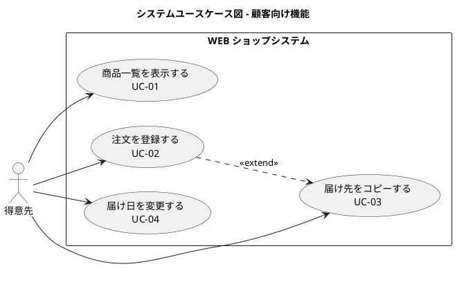
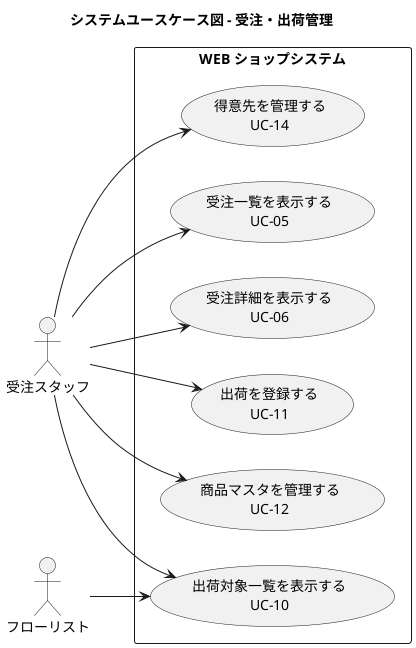
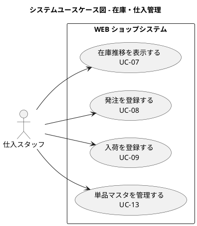

# システムユースケース - フレール・メモワール WEB ショップシステム

## システムユースケース一覧

| ID | システムユースケース | 対応 BUC | アクター |
| :--- | :--- | :--- | :--- |
| UC-01 | 商品一覧を表示する | BUC-01 | 得意先 |
| UC-02 | 注文を登録する | BUC-01 | 得意先 |
| UC-03 | 届け先をコピーする | BUC-01 | 得意先 |
| UC-04 | 届け日を変更する | BUC-02 | 得意先 |
| UC-05 | 受注一覧を表示する | BUC-03 | 受注スタッフ |
| UC-06 | 受注詳細を表示する | BUC-03 | 受注スタッフ |
| UC-07 | 在庫推移を表示する | BUC-04 | 仕入スタッフ |
| UC-08 | 発注を登録する | BUC-05 | 仕入スタッフ |
| UC-09 | 入荷を登録する | BUC-06 | 仕入スタッフ |
| UC-10 | 出荷対象一覧を表示する | BUC-07, BUC-08 | フローリスト、受注スタッフ |
| UC-11 | 出荷を登録する | BUC-08 | 受注スタッフ |
| UC-12 | 商品マスタを管理する | - | 受注スタッフ |
| UC-13 | 単品マスタを管理する | - | 仕入スタッフ |
| UC-14 | 得意先を管理する | BUC-01 | 受注スタッフ |

## システムユースケース図

### 顧客向け機能

### スタッフ向け機能（受注・出荷）

### スタッフ向け機能（在庫・仕入）

## システムユースケース詳細

### UC-01: 商品一覧を表示する

| 項目 | 内容 |
| :--- | :--- |
| 対応 BUC | BUC-01 |
| 主アクター | 得意先 |
| 事前条件 | 商品マスタに商品が登録されている |
| 事後条件 | 商品一覧が表示されている |
| 基本フロー | 1. 得意先が WEB ショップにアクセスする 2. システムが商品一覧を表示する |
| 受入条件 | - 商品名・価格が一覧表示されること |

### UC-02: 注文を登録する

| 項目 | 内容 |
| :--- | :--- |
| 対応 BUC | BUC-01 |
| 主アクター | 得意先 |
| 事前条件 | 商品が選択されている |
| 事後条件 | 受注が登録され、在庫が引き当てられている |
| 基本フロー | 1. 得意先が商品を選択する 2. 届け日・届け先・メッセージを入力する 3. 注文を確定する 4. システムが受注を登録する 5. システムが在庫を引き当てる |
| 代替フロー | 3a. 届け先をコピーする（UC-03） |
| 例外フロー | 4a. 在庫不足の場合はエラーを表示する |
| 受入条件 | - 受注が登録されること - 在庫が引き当てられること - 届け日が翌々日以降であること |

### UC-03: 届け先をコピーする

| 項目 | 内容 |
| :--- | :--- |
| 対応 BUC | BUC-01 |
| 主アクター | 得意先 |
| 事前条件 | 過去の注文が存在する |
| 事後条件 | 過去の届け先情報が入力フォームに反映されている |
| 基本フロー | 1. 得意先が過去の届け先一覧を表示する 2. 届け先を選択する 3. システムが入力フォームに反映する |
| 受入条件 | - 過去の届け先が一覧表示されること - 選択した届け先が入力フォームに反映されること |

### UC-04: 届け日を変更する

| 項目 | 内容 |
| :--- | :--- |
| 対応 BUC | BUC-02 |
| 主アクター | 得意先 |
| 事前条件 | 受注が存在し、出荷前である |
| 事後条件 | 受注の届け日が更新されている |
| 基本フロー | 1. 得意先が変更後の届け日を入力する 2. システムが在庫を確認する 3. 変更を確定する 4. システムが受注の届け日を更新する |
| 例外フロー | 2a. 在庫不足の場合は変更不可を通知する |
| 受入条件 | - 在庫がある場合は届け日が更新されること - 在庫不足の場合は変更不可が通知されること |

### UC-05: 受注一覧を表示する

| 項目 | 内容 |
| :--- | :--- |
| 対応 BUC | BUC-03 |
| 主アクター | 受注スタッフ |
| 事前条件 | なし |
| 事後条件 | 受注一覧が表示されている |
| 基本フロー | 1. スタッフが受注管理画面にアクセスする 2. システムが受注一覧を表示する |
| 受入条件 | - 受注一覧が届け日順に表示されること - 受注ステータスが表示されること |

### UC-06: 受注詳細を表示する

| 項目 | 内容 |
| :--- | :--- |
| 対応 BUC | BUC-03 |
| 主アクター | 受注スタッフ |
| 事前条件 | 受注が存在する |
| 事後条件 | 受注詳細が表示されている |
| 基本フロー | 1. スタッフが受注を選択する 2. システムが受注詳細（商品・届け日・届け先・メッセージ）を表示する |
| 受入条件 | - 受注の全項目が表示されること |

### UC-07: 在庫推移を表示する

| 項目 | 内容 |
| :--- | :--- |
| 対応 BUC | BUC-04 |
| 主アクター | 仕入スタッフ |
| 事前条件 | 単品マスタに品質維持日数が登録されている |
| 事後条件 | 日別の在庫推移が表示されている |
| 基本フロー | 1. スタッフが在庫推移画面にアクセスする 2. システムが単品ごとの日別在庫予定数を表示する |
| 受入条件 | - 日別の在庫予定数が表示されること - 品質維持日数を超える在庫が識別できること |

### UC-08: 発注を登録する

| 項目 | 内容 |
| :--- | :--- |
| 対応 BUC | BUC-05 |
| 主アクター | 仕入スタッフ |
| 事前条件 | 単品マスタに仕入先が登録されている |
| 事後条件 | 発注情報が登録されている |
| 基本フロー | 1. スタッフが単品と発注数量を入力する 2. 発注を確定する 3. システムが発注情報を登録する |
| 受入条件 | - 発注情報が登録されること - 在庫推移に発注分が反映されること |

### UC-09: 入荷を登録する

| 項目 | 内容 |
| :--- | :--- |
| 対応 BUC | BUC-06 |
| 主アクター | 仕入スタッフ |
| 事前条件 | 発注が存在する |
| 事後条件 | 入荷情報が登録され、在庫が更新されている |
| 基本フロー | 1. スタッフが入荷数量を入力する 2. 入荷を確定する 3. システムが入荷情報を登録し、在庫を更新する |
| 受入条件 | - 入荷情報が登録されること - 在庫数が更新されること |

### UC-10: 出荷対象一覧を表示する

| 項目 | 内容 |
| :--- | :--- |
| 対応 BUC | BUC-07, BUC-08 |
| 主アクター | フローリスト、受注スタッフ |
| 事前条件 | 受注が存在する |
| 事後条件 | 出荷対象の受注一覧が表示されている |
| 基本フロー | 1. スタッフが出荷管理画面にアクセスする 2. システムが当日出荷対象（届け日が翌日）の受注一覧を表示する |
| 受入条件 | - 当日出荷対象の受注が一覧表示されること - 花束構成（単品と数量）が確認できること |

### UC-11: 出荷を登録する

| 項目 | 内容 |
| :--- | :--- |
| 対応 BUC | BUC-08 |
| 主アクター | 受注スタッフ |
| 事前条件 | 出荷対象の受注が存在する |
| 事後条件 | 出荷情報が登録され、受注ステータスが出荷済に更新されている |
| 基本フロー | 1. スタッフが出荷対象の受注を選択する 2. 出荷を確定する 3. システムが出荷情報を登録し、受注ステータスを更新する |
| 受入条件 | - 出荷情報が登録されること - 受注ステータスが出荷済に更新されること |

### UC-12: 商品マスタを管理する

| 項目 | 内容 |
| :--- | :--- |
| 対応 BUC | - |
| 主アクター | 受注スタッフ |
| 事前条件 | なし |
| 事後条件 | 商品マスタが更新されている |
| 基本フロー | 1. スタッフが商品マスタ画面にアクセスする 2. 商品（花束）と構成単品・数量を登録・更新する |
| 受入条件 | - 商品名・構成単品・数量が登録できること |

### UC-13: 単品マスタを管理する

| 項目 | 内容 |
| :--- | :--- |
| 対応 BUC | - |
| 主アクター | 仕入スタッフ |
| 事前条件 | なし |
| 事後条件 | 単品マスタが更新されている |
| 基本フロー | 1. スタッフが単品マスタ画面にアクセスする 2. 単品の品質維持日数・購入単位・リードタイム・仕入先を登録・更新する |
| 受入条件 | - 品質維持日数・購入単位・リードタイム・仕入先が登録できること |

### UC-14: 得意先を管理する

| 項目 | 内容 |
| :--- | :--- |
| 対応 BUC | BUC-01 |
| 主アクター | 受注スタッフ |
| 事前条件 | なし |
| 事後条件 | 得意先情報が更新されている |
| 基本フロー | 1. スタッフが得意先管理画面にアクセスする 2. 得意先情報を登録・更新する |
| 受入条件 | - 得意先情報が登録・更新できること |
