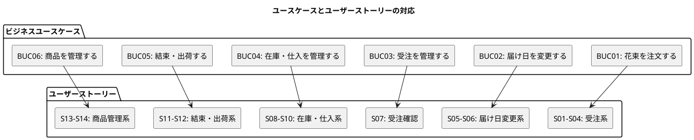

# ユーザーストーリー - フレール・メモワール WEB ショップ

## トレーサビリティ

## 受注系ストーリー

### S01: 花束を注文する

**として**: 得意先
**したい**: WEB ショップで花束を選び、届け日・届け先・メッセージを指定して注文したい
**なぜなら**: 大切な人の記念日に新鮮な花束を届けたいからだ

**受入基準**:

- [ ] 商品一覧から花束を選択できる
- [ ] 届け日を指定できる
- [ ] 届け先（住所・電話番号）を入力できる
- [ ] お届けメッセージを入力できる
- [ ] 注文内容を確認してから確定できる
- [ ] 注文確定後、受注が登録される

**対応 UC**: UC01

**ストーリーポイント**: 5

### S02: 届け先をコピーする

**として**: 得意先（リピーター）
**したい**: 過去の注文の届け先情報をコピーして再利用したい
**なぜなら**: 同じ届け先に何度も送ることがあり、毎回入力するのは手間だからだ

**受入基準**:

- [ ] 過去の届け先一覧が表示される
- [ ] 選択した届け先の情報が注文画面に自動入力される

**対応 UC**: UC02

**ストーリーポイント**: 2

### S03: 商品一覧を閲覧する

**として**: 得意先
**したい**: WEB ショップで花束の一覧を閲覧したい
**なぜなら**: どんな花束があるか確認してから注文したいからだ

**受入基準**:

- [ ] 登録されている花束の一覧が表示される
- [ ] 花束の詳細（構成する花の種類と数量）が確認できる

**対応 UC**: UC01（ステップ 1-2）

**ストーリーポイント**: 2

### S04: 得意先を管理する

**として**: 受注スタッフ
**したい**: 得意先の情報を登録・管理したい
**なぜなら**: リピーター管理と届け先コピー機能に必要だからだ

**受入基準**:

- [ ] 得意先情報（名前・連絡先）を登録できる
- [ ] 得意先の過去の届け先一覧が確認できる

**対応 UC**: UC01（事前条件）

**ストーリーポイント**: 3

### S15: 注文をキャンセルする

**として**: 得意先
**したい**: 注文した花束の注文をキャンセルしたい
**なぜなら**: 予定が変わった場合に不要な注文を取り消したいからだ

**受入基準**:

- [ ] 注文済みの受注に対してキャンセルを申請できる
- [ ] 出荷準備中以降の受注はキャンセルできない
- [ ] キャンセル時、引当済み在庫が有効在庫に戻される
- [ ] キャンセル後、受注状態が「キャンセル」に更新される

**対応 UC**: UC01（拡張 7a）

**ストーリーポイント**: 3

## 届け日変更系ストーリー

### S05: 届け日変更を依頼する

**として**: 得意先
**したい**: 注文した花束の届け日を変更したい
**なぜなら**: 予定が変わることがあり、届け日を柔軟に調整したいからだ

**受入基準**:

- [ ] 注文済みの受注に対して届け日変更を依頼できる
- [ ] 変更可能な場合、届け日が更新される
- [ ] 変更不可の場合、その旨が通知される

**対応 UC**: UC03

**ストーリーポイント**: 3

### S06: 届け日変更の可否を判断する

**として**: 受注スタッフ
**したい**: 届け日変更の依頼に対して出荷可否を確認したい
**なぜなら**: 在庫状況を考慮して変更可否を正確に判断したいからだ

**受入基準**:

- [ ] 変更後の届け日で必要な花材の在庫状況が確認できる
- [ ] 変更可否の判断結果を記録できる

**対応 UC**: UC03（ステップ 2）

**ストーリーポイント**: 3

## 受注確認ストーリー

### S07: 受注一覧を確認する

**として**: 受注スタッフ
**したい**: 受注の一覧と詳細を確認したい
**なぜなら**: 受注状況を把握して業務を管理したいからだ

**受入基準**:

- [ ] 受注一覧が表示される（注文済み・出荷準備中・出荷済み）
- [ ] 受注の詳細（商品・届け日・届け先・メッセージ）が確認できる
- [ ] 状態でフィルタリングできる

**対応 UC**: UC04

**ストーリーポイント**: 3

## 在庫・仕入系ストーリー

### S08: 在庫推移を確認する

**として**: 仕入スタッフ
**したい**: 単品ごとの日別在庫予定数を確認したい
**なぜなら**: 品質維持日数を考慮した適切な発注判断をしたいからだ

**受入基準**:

- [ ] 単品ごとの日別在庫予定数が表示される
- [ ] 在庫予定数は現在庫 + 入荷予定 - 受注引当 - 品質維持日数超過分で計算される
- [ ] 品質維持日数を超過する在庫が識別できる

**対応 UC**: UC05

**ストーリーポイント**: 5

### S09: 単品を発注する

**として**: 仕入スタッフ
**したい**: 仕入先に単品を発注したい
**なぜなら**: 在庫推移を見て必要な花材を適切なタイミングで確保したいからだ

**受入基準**:

- [ ] 発注する単品の仕入先・購入単位・リードタイムが表示される
- [ ] 発注数量を指定できる（購入単位の倍数に自動調整）
- [ ] 発注を確定すると発注記録が作成される
- [ ] 入荷予定日がリードタイムから自動計算される

**対応 UC**: UC06

**ストーリーポイント**: 3

### S10: 入荷を受け入れる

**として**: 仕入スタッフ
**したい**: 入荷した単品の数量を記録したい
**なぜなら**: 正確な在庫推移を把握するために入荷実績を反映する必要があるからだ

**受入基準**:

- [ ] 入荷した単品と数量を登録できる
- [ ] 在庫に入荷分が反映される
- [ ] 発注が「入荷済み」に更新される

**対応 UC**: UC07

**ストーリーポイント**: 2

## 結束・出荷系ストーリー

### S11: 出荷対象を確認する

**として**: フローリスト
**したい**: 出荷日の受注一覧と必要な花材を確認したい
**なぜなら**: 結束に必要な花材を正確に把握して作業したいからだ

**受入基準**:

- [ ] 出荷日（= 届け日の前日）の受注一覧が表示される
- [ ] 各受注の商品構成（花材の種類と数量）が確認できる

**対応 UC**: UC08

**ストーリーポイント**: 3

### S12: 出荷を記録する

**として**: 配送スタッフ
**したい**: 花束の出荷を記録したい
**なぜなら**: 出荷状況を正確に管理し、出荷漏れを防ぎたいからだ

**受入基準**:

- [ ] 出荷対象の受注を選択して出荷を記録できる
- [ ] 受注状態が「出荷済み」に更新される

**対応 UC**: UC09

**ストーリーポイント**: 2

## 商品管理系ストーリー

### S13: 商品（花束）を管理する

**として**: スタッフ
**したい**: 花束の構成（使用する花の種類と本数）を登録・更新したい
**なぜなら**: WEB ショップに掲載する商品を管理する必要があるからだ

**受入基準**:

- [ ] 商品の名称を登録できる
- [ ] 商品の構成（単品と数量の組合せ）を登録できる
- [ ] 既存商品の構成を更新できる

**対応 UC**: UC10

**ストーリーポイント**: 3

### S14: 単品（花）を管理する

**として**: スタッフ
**したい**: 花の単品情報（品質維持日数・購入単位・リードタイム・仕入先）を登録・更新したい
**なぜなら**: 在庫管理と発注管理の基盤となるマスタデータだからだ

**受入基準**:

- [ ] 単品の名称・品質維持可能日数・購入単位・発注リードタイムを登録できる
- [ ] 単品に仕入先を紐づけられる
- [ ] 既存単品の情報を更新できる

**対応 UC**: UC11

**ストーリーポイント**: 2

## ストーリーポイント集計

| フェーズ | ストーリー | 合計ポイント |
| :--- | :--- | :--- |
| フェーズ 1（MVP） | S03, S13, S14, S01, S08, S07 | 20 |
| フェーズ 2 | S09, S10, S11, S12, S04, S02 | 15 |
| フェーズ 3 | S05, S06, S15 | 9 |
| **合計** | **15 ストーリー** | **44** |
